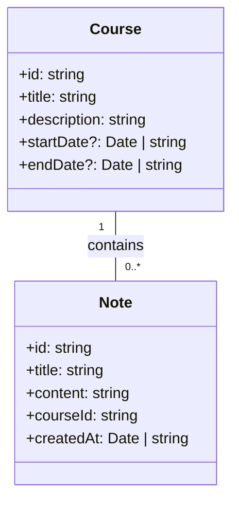

# Curso: Engenharia de Software
# Aluno: Diego Rios dos Santos (202010774)
# Disciplina: ENGENHARIA DE SOFTWARE CONTINUA 8º Periodo
# Professor: Fabricio Dias

# Plataforma

Um aplicativo web para gerenciamento de cursos, matrículas e progresso dos alunos.

## Pré-requisitos

- Node.js (v18 ou superior recomendado)
- npm ou yarn

## Instalação

1. Clone o repositório:
   ```bash
   git clone <url_do_repositorio>
   cd <nome_da_pasta_do_projeto>
   ```

2. Instale as dependências:
   ```bash
   npm install
   # ou
   yarn install
   ```

## Executando o Aplicativo

1. Inicie o servidor de desenvolvimento:
   ```bash
   npm run dev
   # ou
   yarn dev
   ```

2. O aplicativo estará disponível na porta `http://localhost:9002`.

## Funcionalidades

- **Gerenciamento de Cursos:** Criar, editar, visualizar e excluir cursos.
- **Gerenciamento de Notas:** Adicionar, editar, visualizar e excluir notas associadas a cursos específicos.
- **Visualização de Notas por Curso:** Filtrar e visualizar notas pertencentes a um curso específico.
- **Relatórios:** Visualizar um resumo da quantidade de cursos e notas, e um gráfico de barras mostrando a distribuição de notas por curso.

## Estrutura do Projeto

```
/
├── public/             # Arquivos estáticos
├── src/
│   ├── app/            # Rotas e páginas principais da aplicação (Next.js App Router)
│   │   ├── (app)/      # Grupo de rotas para a área logada/principal
│   │   │   ├── courses/ # Páginas relacionadas a cursos
│   │   │   ├── notes/   # Página de visualização de todas as notas
│   │   │   └── reports/ # Página de relatórios
│   │   ├── api/        # (Opcional) Rotas de API, se necessário
│   │   ├── globals.css # Estilos globais
│   │   └── layout.tsx  # Layout raiz da aplicação
│   ├── components/     # Componentes React reutilizáveis
│   │   ├── course/     # Componentes específicos para cursos (Card, Dialog, Form)
│   │   ├── note/       # Componentes específicos para notas (Card, Dialog, Form)
│   │   ├── report/     # Componentes específicos para relatórios (Chart)
│   │   ├── ui/         # Componentes de UI (Shadcn/ui)
│   │   ├── app-sidebar.tsx # Componente da barra lateral
│   │   └── page-header.tsx # Componente do cabeçalho da página
│   ├── data/           # Funções de acesso e manipulação de dados (simulação in-memory)
│   │   ├── courses.ts
│   │   └── notes.ts
│   ├── hooks/          # Hooks React customizados
│   │   ├── use-mobile.tsx
│   │   └── use-toast.ts
│   ├── lib/            # Funções utilitárias
│   │   └── utils.ts
│   └── types/          # Definições de tipos TypeScript
│       └── index.ts
├── .env.example        # Exemplo de variáveis de ambiente
├── .eslintrc.json      # Configuração do ESLint
├── .gitignore          # Arquivos ignorados pelo Git
├── components.json     # Configuração do Shadcn/ui
├── next.config.ts      # Configuração do Next.js
├── package.json        # Dependências e scripts do projeto
├── README.md           # Este arquivo
└── tsconfig.json       # Configuração do TypeScript
```

## Rotas da API

Este projeto atualmente utiliza funções assíncronas diretamente nos componentes de página (`"use client"`) para buscar e manipular dados simulados em `src/data/`. Não há rotas de API separadas implementadas. As operações de dados (CRUD para Cursos e Notas) são realizadas pelas funções exportadas em `src/data/courses.ts` e `src/data/notes.ts`.

## Stack Tecnológico

- **Framework:** Next.js (com App Router)
- **Linguagem:** TypeScript
- **UI:** React
- **Componentes UI:** Shadcn/ui, Lucide Icons, Recharts
- **Estilização:** Tailwind CSS
- **Gerenciamento de Formulários:** React Hook Form
- **Validação de Schema:** Zod
- **Notificações (Toast):** Implementação customizada (baseada em `react-hot-toast`)
- **Manipulação de Datas:** date-fns
- **Persistência de Dados:** Simulação em memória (arquivos em `src/data/`)

## Diagrama UML

*(Adicione aqui um diagrama UML, se aplicável. Pode ser uma imagem ou link.)*



## Modelo relacional e modelo de documentos

**Modelo Relacional (Conceitual):**

- **Tabela Cursos:**
  - `id` (Chave Primária)
  - `title` (Texto)
  - `description` (Texto)
  - `startDate` (Data, Opcional)
  - `endDate` (Data, Opcional)

- **Tabela Notas:**
  - `id` (Chave Primária)
  - `title` (Texto)
  - `content` (Texto Longo)
  - `createdAt` (Timestamp)
  - `courseId` (Chave Estrangeira referenciando Cursos.id)

**Modelo de Documentos (Exemplo NoSQL/JSON):**

*Coleção `courses`:*

```json
{
  "_id": "string (ObjectId)", // ou id: string
  "title": "string",
  "description": "string",
  "startDate": "ISODate | null", // ou string "YYYY-MM-DD"
  "endDate": "ISODate | null" // ou string "YYYY-MM-DD"
}
```

*Coleção `notes`:*

```json
{
  "_id": "string (ObjectId)", // ou id: string
  "title": "string",
  "content": "string",
  "createdAt": "ISODate", // ou string ISO 8601
  "courseId": "string (referência ao _id do curso)"
}
```

*Nota: A implementação atual usa um modelo simples em memória com arrays e objetos JavaScript, conforme definido em `src/types/index.ts` e simulado em `src/data/`.*
